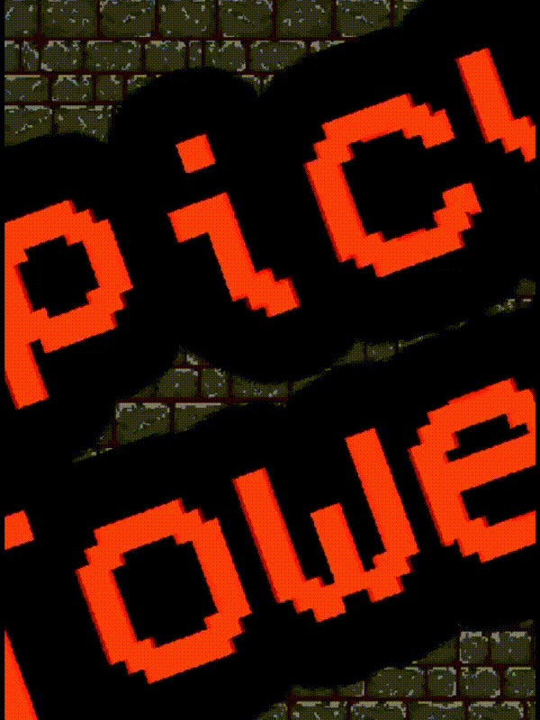

# 🌶️ [Spicy Tower](https://spicy-tower.vercel.app)

> A lightweight **Icy Tower** clone made with [Kaplay.js](https://kaplayjs.com)!

### A fast-paced, rage-inducing vertical scroller  

---

## 🕹️ Features

- Very ***Spicy*** gameplay that'll test your reflexes 🌶️
- 💀 Difficulty increases the higher you go
- ⏫ The faster you move, the higher you jump — and the faster your score climbs!
- 🎧 Retro SFX and music for max nostalgia
- 🎨 Parallax scrolling for sweet depth
- 🧪 90% code, 10% duct tape, 100% passion — it’s a fun little mess
- 🧙‍♂️ An epic final boss? Maybe. You'll have to find out...

---

## 🎮 Controls

### PC:
- **WASD** or **Arrow Keys** to move
- **Spacebar** to jump

### Mobile:
- On-screen **touch controls**!

---

## 🧠 Backstory

I built this project in just **one week** for a competition at **Route Academy**.  
It's chaotic, fun, and may cause mild keyboard damage — but I hope you enjoy it even a little bit ❤️

## What are you waiting for ? Go try it out !   
# https://spicy-tower.vercel.app

---
## -***Boltawy***
